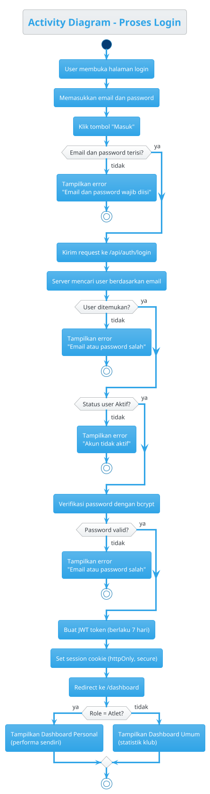
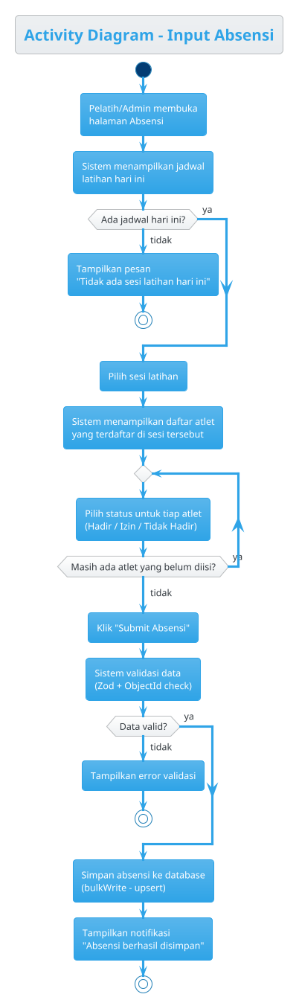
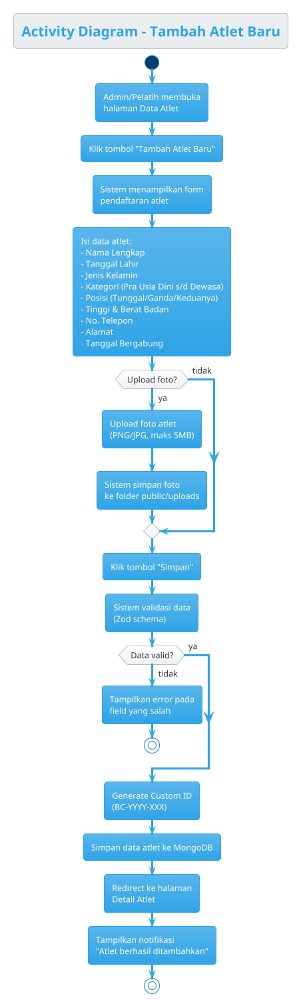
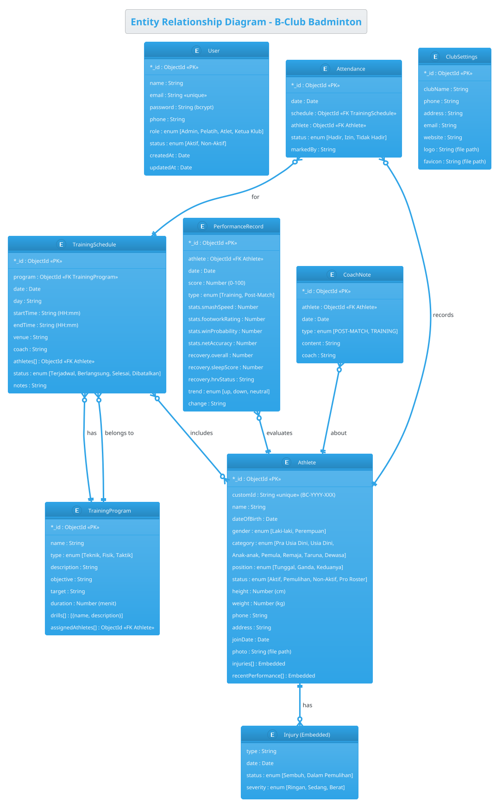
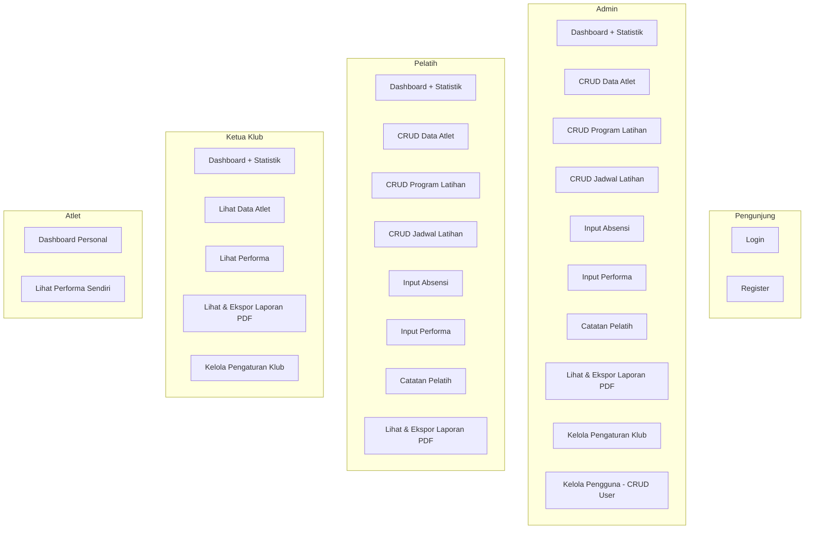

# Diagram B-Club Badminton

Kode diagram di bawah bisa di-render menggunakan tool online:
- **PlantUML:** https://www.plantuml.com/plantuml/uml
- **Mermaid:** https://mermaid.live

---

## 1. Use Case Diagram (PlantUML)

Copy-paste kode di bawah ke https://www.plantuml.com/plantuml/uml lalu klik **Submit**.

```plantuml
@startuml
!theme cerulean
skinparam actorStyle awesome
skinparam packageStyle rectangle
skinparam usecase {
  BackgroundColor<<admin>> #E8F5E9
  BackgroundColor<<pelatih>> #E3F2FD
  BackgroundColor<<ketua>> #FFF3E0
  BackgroundColor<<atlet>> #FCE4EC
  BackgroundColor<<publik>> #F3E5F5
  BackgroundColor<<semua>> #ECEFF1
}

title Use Case Diagram - B-Club Badminton\nSistem Pembinaan Atlet Bulutangkis

actor "Admin" as admin #green
actor "Pelatih" as pelatih #blue
actor "Ketua Klub" as ketua #orange
actor "Atlet" as atlet #pink
actor "Pengunjung" as publik #purple

rectangle "Sistem B-Club Badminton" {

  ' === AUTENTIKASI ===
  package "Autentikasi" {
    usecase "Login" as UC_LOGIN <<publik>>
    usecase "Register\n(sebagai Atlet)" as UC_REGISTER <<publik>>
    usecase "Logout" as UC_LOGOUT <<semua>>
    usecase "Edit Profil Sendiri" as UC_EDIT_PROFILE <<semua>>
  }

  ' === DASHBOARD ===
  package "Dashboard" {
    usecase "Lihat Dashboard\n(Statistik Klub)" as UC_DASHBOARD <<semua>>
    usecase "Lihat Dashboard\nPersonal (Performa Sendiri)" as UC_DASHBOARD_ATLET <<atlet>>
    usecase "Lihat Quick Actions" as UC_QUICK_ACTIONS <<admin>>
  }

  ' === DATA ATLET ===
  package "Manajemen Data Atlet" {
    usecase "Lihat Daftar Atlet" as UC_LIST_ATHLETE <<semua>>
    usecase "Lihat Detail Atlet" as UC_VIEW_ATHLETE <<semua>>
    usecase "Tambah Atlet Baru" as UC_ADD_ATHLETE <<pelatih>>
    usecase "Edit Data Atlet" as UC_EDIT_ATHLETE <<pelatih>>
    usecase "Hapus Atlet" as UC_DELETE_ATHLETE <<pelatih>>
    usecase "Upload Foto Atlet" as UC_UPLOAD_PHOTO <<pelatih>>
    usecase "Kelola Cedera Atlet" as UC_MANAGE_INJURY <<pelatih>>
  }

  ' === PROGRAM LATIHAN ===
  package "Program Latihan" {
    usecase "Lihat Program Latihan" as UC_LIST_PROGRAM <<semua>>
    usecase "Lihat Detail Program" as UC_VIEW_PROGRAM <<semua>>
    usecase "Buat Program Latihan" as UC_ADD_PROGRAM <<pelatih>>
    usecase "Edit Program Latihan" as UC_EDIT_PROGRAM <<pelatih>>
    usecase "Hapus Program Latihan" as UC_DELETE_PROGRAM <<pelatih>>
  }

  ' === JADWAL LATIHAN ===
  package "Jadwal Latihan" {
    usecase "Lihat Jadwal\n(Kalender/List)" as UC_LIST_SCHEDULE <<semua>>
    usecase "Buat Jadwal Latihan" as UC_ADD_SCHEDULE <<pelatih>>
    usecase "Edit Jadwal Latihan" as UC_EDIT_SCHEDULE <<pelatih>>
    usecase "Hapus Jadwal Latihan" as UC_DELETE_SCHEDULE <<pelatih>>
  }

  ' === ABSENSI ===
  package "Absensi" {
    usecase "Lihat Riwayat Absensi" as UC_LIST_ATTENDANCE <<semua>>
    usecase "Input Absensi\n(Hadir/Izin/Tidak Hadir)" as UC_MARK_ATTENDANCE <<pelatih>>
  }

  ' === MONITORING PERFORMA ===
  package "Monitoring Performa" {
    usecase "Lihat Performa\nSemua Atlet" as UC_LIST_PERF <<semua>>
    usecase "Lihat Detail Performa\nAtlet" as UC_VIEW_PERF <<semua>>
    usecase "Input Nilai Performa" as UC_ADD_PERF <<pelatih>>
    usecase "Buat Catatan Pelatih" as UC_ADD_NOTE <<pelatih>>
    usecase "Edit Catatan Pelatih" as UC_EDIT_NOTE <<pelatih>>
    usecase "Hapus Catatan Pelatih" as UC_DELETE_NOTE <<pelatih>>
  }

  ' === LAPORAN ===
  package "Laporan" {
    usecase "Lihat Rekap\nLatihan Bulanan" as UC_REPORT_MONTHLY <<ketua>>
    usecase "Lihat Rekap\nPerforma Atlet" as UC_REPORT_PERF <<ketua>>
    usecase "Lihat Rekap\nKehadiran" as UC_REPORT_ATTENDANCE <<ketua>>
    usecase "Ekspor Laporan PDF" as UC_EXPORT_PDF <<ketua>>
  }

  ' === PENGATURAN ===
  package "Pengaturan" {
    usecase "Kelola Pengaturan Klub\n(Nama, Alamat, Logo)" as UC_CLUB_SETTINGS <<ketua>>
    usecase "Kelola Pengguna\n(CRUD User)" as UC_USER_MGMT <<admin>>
    usecase "Tambah User Baru" as UC_ADD_USER <<admin>>
    usecase "Ubah Role/Status User" as UC_EDIT_USER <<admin>>
    usecase "Hapus User" as UC_DELETE_USER <<admin>>
  }
}

' === RELASI PENGUNJUNG ===
publik --> UC_LOGIN
publik --> UC_REGISTER

' === RELASI ADMIN (semua fitur) ===
admin --> UC_LOGOUT
admin --> UC_EDIT_PROFILE
admin --> UC_DASHBOARD
admin --> UC_QUICK_ACTIONS
admin --> UC_LIST_ATHLETE
admin --> UC_VIEW_ATHLETE
admin --> UC_ADD_ATHLETE
admin --> UC_EDIT_ATHLETE
admin --> UC_DELETE_ATHLETE
admin --> UC_UPLOAD_PHOTO
admin --> UC_MANAGE_INJURY
admin --> UC_LIST_PROGRAM
admin --> UC_VIEW_PROGRAM
admin --> UC_ADD_PROGRAM
admin --> UC_EDIT_PROGRAM
admin --> UC_DELETE_PROGRAM
admin --> UC_LIST_SCHEDULE
admin --> UC_ADD_SCHEDULE
admin --> UC_EDIT_SCHEDULE
admin --> UC_DELETE_SCHEDULE
admin --> UC_LIST_ATTENDANCE
admin --> UC_MARK_ATTENDANCE
admin --> UC_LIST_PERF
admin --> UC_VIEW_PERF
admin --> UC_ADD_PERF
admin --> UC_ADD_NOTE
admin --> UC_EDIT_NOTE
admin --> UC_DELETE_NOTE
admin --> UC_REPORT_MONTHLY
admin --> UC_REPORT_PERF
admin --> UC_REPORT_ATTENDANCE
admin --> UC_EXPORT_PDF
admin --> UC_CLUB_SETTINGS
admin --> UC_USER_MGMT
admin --> UC_ADD_USER
admin --> UC_EDIT_USER
admin --> UC_DELETE_USER

' === RELASI PELATIH ===
pelatih --> UC_LOGOUT
pelatih --> UC_EDIT_PROFILE
pelatih --> UC_DASHBOARD
pelatih --> UC_LIST_ATHLETE
pelatih --> UC_VIEW_ATHLETE
pelatih --> UC_ADD_ATHLETE
pelatih --> UC_EDIT_ATHLETE
pelatih --> UC_DELETE_ATHLETE
pelatih --> UC_UPLOAD_PHOTO
pelatih --> UC_MANAGE_INJURY
pelatih --> UC_LIST_PROGRAM
pelatih --> UC_VIEW_PROGRAM
pelatih --> UC_ADD_PROGRAM
pelatih --> UC_EDIT_PROGRAM
pelatih --> UC_DELETE_PROGRAM
pelatih --> UC_LIST_SCHEDULE
pelatih --> UC_ADD_SCHEDULE
pelatih --> UC_EDIT_SCHEDULE
pelatih --> UC_DELETE_SCHEDULE
pelatih --> UC_LIST_ATTENDANCE
pelatih --> UC_MARK_ATTENDANCE
pelatih --> UC_LIST_PERF
pelatih --> UC_VIEW_PERF
pelatih --> UC_ADD_PERF
pelatih --> UC_ADD_NOTE
pelatih --> UC_EDIT_NOTE
pelatih --> UC_DELETE_NOTE
pelatih --> UC_REPORT_MONTHLY
pelatih --> UC_REPORT_PERF
pelatih --> UC_REPORT_ATTENDANCE
pelatih --> UC_EXPORT_PDF

' === RELASI KETUA KLUB ===
ketua --> UC_LOGOUT
ketua --> UC_EDIT_PROFILE
ketua --> UC_DASHBOARD
ketua --> UC_LIST_ATHLETE
ketua --> UC_VIEW_ATHLETE
ketua --> UC_LIST_PERF
ketua --> UC_VIEW_PERF
ketua --> UC_REPORT_MONTHLY
ketua --> UC_REPORT_PERF
ketua --> UC_REPORT_ATTENDANCE
ketua --> UC_EXPORT_PDF
ketua --> UC_CLUB_SETTINGS

' === RELASI ATLET ===
atlet --> UC_LOGOUT
atlet --> UC_EDIT_PROFILE
atlet --> UC_DASHBOARD_ATLET
atlet --> UC_LIST_PERF
atlet --> UC_VIEW_PERF

@enduml
```

---

## 2. Activity Diagram - Proses Login (PlantUML)

---

## 3. Activity Diagram - Input Absensi (PlantUML)

---

## 4. Activity Diagram - Tambah Atlet (PlantUML)

---

## 5. Class Diagram / ERD (PlantUML)

---

## 6. Use Case Diagram Sederhana (Mermaid)

Untuk render cepat, paste ke https://mermaid.live

---

## 7. CRUD Matrix per Role

| Modul | Admin | Pelatih | Ketua Klub | Atlet |
|-------|-------|---------|------------|-------|
| **Data Atlet** | CRUD | CRUD | Read | - |
| **Program Latihan** | CRUD | CRUD | - | - |
| **Jadwal Latihan** | CRUD | CRUD | - | - |
| **Absensi** | Create, Read | Create, Read | - | - |
| **Performa** | Create, Read | Create, Read | Read | Read (sendiri) |
| **Catatan Pelatih** | CRUD | CRUD | - | - |
| **Laporan** | Read, Export PDF | Read, Export PDF | Read, Export PDF | - |
| **Pengguna** | CRUD | - | Read | - |
| **Pengaturan Klub** | Read, Update | - | Read, Update | - |
| **Profil Sendiri** | Read, Update | Read, Update | Read, Update | Read, Update |

---

## Cara Render Diagram

### PlantUML (Diagram 1-5)
1. Buka https://www.plantuml.com/plantuml/uml
2. Hapus kode default
3. Paste kode PlantUML di atas
4. Klik **Submit**
5. Klik kanan gambar → **Save image as** untuk download

### Mermaid (Diagram 6)
1. Buka https://mermaid.live
2. Hapus kode default di editor kiri
3. Paste kode Mermaid di atas
4. Diagram otomatis muncul di kanan
5. Klik ikon download (PNG/SVG)

### Alternatif: ChatGPT / AI Image
Kamu juga bisa copy tabel CRUD Matrix atau deskripsi role di atas, lalu paste ke ChatGPT dan minta:
> "Buatkan use case diagram berdasarkan data ini dalam bentuk gambar"
